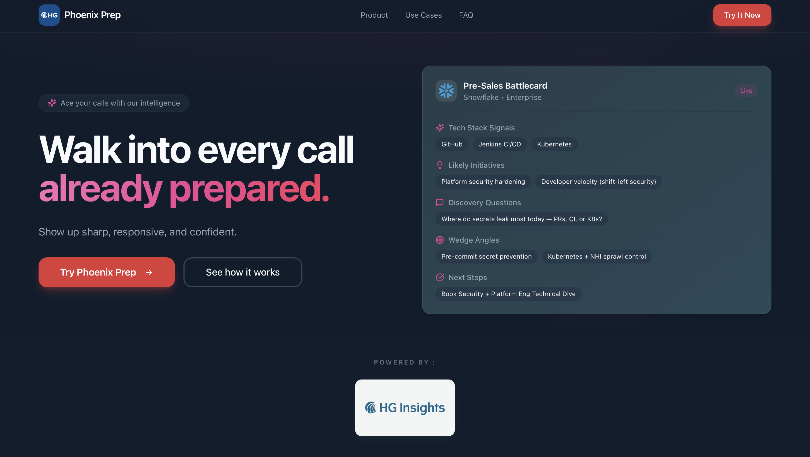

# PhoenixPrep - Powered by HG Insights

PhoenixPrep is a pre-call prep tool that helps sales reps ace their calls. Built for reps selling into tech companies, it turns raw account intelligence from HG Insights into a focused, ready-to-use game plan for every meeting.

Point it at a prospect and it generates a **sales battlecard** — and an exportable **PDF** to review before you hop on the call — so you walk in knowing how to direct the conversation, which product to lead with, what pain points to probe, and the discovery questions that move the deal forward.



## Features

- 💬 **Chat Interface** - Clean, intuitive chat UI
- 🔧 **Tool Calling** - LLM automatically calls MCP tools/prompts
- 🐛 **Debug Panel** - Real-time visibility into tool executions
- 📋 **Research Rule Generator** - Quick action to generate research workflows
- 🎯 **MCP Integration** - Supports both tools and prompts from Phoenix MCP

## Quick Start

### 1. Install Dependencies

```bash
cd hg-research-chat
npm install
```

### 2. Configure Environment Variables

Copy the example environment file:

```bash
cp .env.example .env.local
```

Edit `.env.local` and add your API keys:

```env
# LLM Provider (OpenRouter)
OPENROUTER_API_KEY=your_openrouter_api_key_here
OPENROUTER_MODEL=openai/gpt-4-turbo

# Phoenix MCP Configuration
MCP_BASE_URL=https://phoenix.hginsights.com/api/ai/YOUR_API_KEY/mcp
MCP_AUTH_TOKEN=your_bearer_token_here
```

**Getting API Keys:**
- **OpenRouter**: Sign up at https://openrouter.ai and get your API key
- **Phoenix MCP**: Get your Phoenix API key from HG Insights dashboard

### 3. Run Development Server

```bash
npm run dev
```

Open http://localhost:3000 in your browser.

## How to Use

### Basic Chat

1. Type a question in the input box
2. Press Enter or click Send
3. Watch the assistant respond using MCP tools
4. Check the debug panel on the right to see tool executions

### Research Rule Generator

1. Click the "📋 Generate Research Rule" button
2. Fill in the form:
   - **Objective**: What you want to research
   - **Target Audience**: Who will use this research
   - **Technology Filters**: Specific technologies to focus on
   - **Checkboxes**: Include intent signals and/or spend analysis
3. Click "Generate Research Rule"
4. The assistant will call the `research_rule_generator` prompt and return a structured workflow

### Example Questions

- "What tools are available?"
- "Search for companies using Salesforce"
- "Analyze the technology stack for microsoft.com"
- "Show me intent signals for companies in the healthcare industry"
- "List all product categories"

## Architecture

### Project Structure

```
hg-research-chat/
├── app/
│   ├── layout.tsx              # Root layout
│   ├── page.tsx                # Main chat page
│   └── api/
│       └── chat/
│           └── route.ts        # Chat API endpoint
├── components/
│   ├── ChatInterface.tsx       # Main chat container
│   ├── MessageList.tsx         # Message display
│   ├── MessageInput.tsx        # Input box + buttons
│   ├── ToolCallsDebugPanel.tsx # Tool execution debug panel
│   └── ResearchRuleModal.tsx   # Research rule form
├── lib/
│   ├── types.ts                # TypeScript definitions
│   ├── mcpClient.ts            # MCP protocol client
│   └── agent.ts                # LLM orchestration loop
├── .env.example                # Environment template
└── README.md                   # This file
```

### How It Works

1. **User sends message** → Frontend calls `/api/chat`
2. **Agent loop starts** → `lib/agent.ts` orchestrates the flow
3. **LLM receives message** → With tool schemas from MCP
4. **LLM requests tool calls** → If needed for the query
5. **Tools execute** → `lib/mcpClient.ts` calls Phoenix MCP
6. **Results feed back** → To LLM for final response
7. **Response returns** → To frontend with tool execution logs
8. **Debug panel updates** → Shows all tool calls

### MCP Integration

The MCP client (`lib/mcpClient.ts`) supports:

- **`listTools()`** - Get available MCP tools
- **`callTool(name, args)`** - Execute a tool
- **`listPrompts()`** - Get available MCP prompts
- **`callPrompt(name, args)`** - Execute a prompt (e.g., research_rule_generator)

**TODO Markers:**

The MCP client has clear `// TODO:` comments where you need to plug in the actual MCP protocol calls. Currently, it uses mocked responses for development.

## Plugging in Real MCP Endpoint

### Step 1: Configure Environment

In `.env.local`, set your real Phoenix MCP endpoint:

```env
MCP_BASE_URL=https://phoenix.hginsights.com/api/ai/YOUR_ACTUAL_API_KEY/mcp
MCP_AUTH_TOKEN=your_actual_bearer_token
```

### Step 2: Update MCP Client

Open `lib/mcpClient.ts` and find the `// TODO:` comments. Uncomment the actual fetch calls and implement the MCP protocol.

Example for `callTool`:

```typescript
export async function callTool(name: string, args: Record<string, any>): Promise<any> {
  const response = await fetch(`${MCP_BASE_URL}/tools/${name}`, {
    method: 'POST',
    headers: {
      'Authorization': `Bearer ${MCP_AUTH_TOKEN}`,
      'Content-Type': 'application/json',
    },
    body: JSON.stringify({ arguments: args }),
  });
  
  if (!response.ok) {
    throw new Error(`MCP tool call failed: ${response.statusText}`);
  }
  
  return await response.json();
}
```

### Step 3: Test

1. Restart the dev server
2. Ask a question that requires a tool
3. Check the debug panel to verify real MCP data is returned

## Verifying Tool Calls

### In the UI

1. Send a message that should trigger a tool call
2. Look at the debug panel on the right
3. You should see:
   - Tool name
   - Arguments passed
   - Result preview
   - Execution time
4. Click the arrow to expand and see full results

### In the Console

Open browser DevTools (F12) and check the Console tab for:
- API requests to `/api/chat`
- Tool execution logs
- Any errors

### Test Scenarios

**Scenario 1: List Tools**
- Ask: "What tools are available?"
- Expected: LLM calls `listTools()` or lists them from memory

**Scenario 2: Company Search**
- Ask: "Find companies using Salesforce"
- Expected: LLM calls `company_search` with appropriate filters

**Scenario 3: Research Rule**
- Click "Generate Research Rule"
- Fill in form and submit
- Expected: LLM calls `research_rule_generator` prompt
- Result: Markdown workflow is returned

## Next Steps: Evolving to Pre-sales Prep

This MVP is architected to support evolution into a full pre-sales prep product:

### Phase 2: Pre-sales Prep Features

1. **Prep Report Generation**
   - Add new prompt: `prep_report_generator`
   - Input: Company name, meeting type, attendees
   - Output: Comprehensive prep document

2. **Meeting Agenda Creation**
   - Add tool: `generate_agenda`
   - Based on company data and meeting goals

3. **Objection Handling Database**
   - Store common objections
   - Generate responses based on company context

4. **Discovery Questions Generator**
   - Create targeted questions based on:
     - Company tech stack
     - Industry
     - Intent signals

5. **Battlecard Creation**
   - Compare your product vs. competitors
   - Use technographic data to identify gaps

### Phase 3: Call Simulation

1. **Roleplay Mode**
   - LLM plays the prospect
   - Uses company data for realistic responses

2. **Objection Practice**
   - Simulate common objections
   - Provide feedback on responses

3. **Conversation Recording**
   - Save practice sessions
   - Review and improve

### Implementation Path

1. **Add new prompts** to MCP server for prep features
2. **Create new UI components** for each feature
3. **Extend agent.ts** with feature-specific logic
4. **Add routing** for different modes (chat, prep, roleplay)

The current architecture supports all of this without major refactoring.

## Troubleshooting

### "OPENROUTER_API_KEY not configured"

- Make sure `.env.local` exists and has your API key
- Restart the dev server after adding environment variables

### "Failed to get response"

- Check browser console for detailed error
- Verify OpenRouter API key is valid
- Check network tab for API request/response

### Tool calls not showing in debug panel

- Make sure the LLM is actually calling tools (check console)
- Verify `toolExecutions` array is being populated
- Check that debug panel is receiving the data

### Mocked responses instead of real data

- This is expected if `MCP_BASE_URL` contains "YOUR_API_KEY"
- Update `.env.local` with your real endpoint
- Implement the TODO sections in `lib/mcpClient.ts`

## Tech Stack

- **Next.js 15** - React framework with App Router
- **TypeScript** - Type safety
- **Tailwind CSS** - Styling
- **OpenRouter** - LLM provider (supports multiple models)
- **Phoenix MCP** - HG Insights MCP server

## Support

For issues or questions:
1. Check this README
2. Review the code comments
3. Check browser console for errors
4. Contact me

---

**Built with ❤️ for sales teams**
